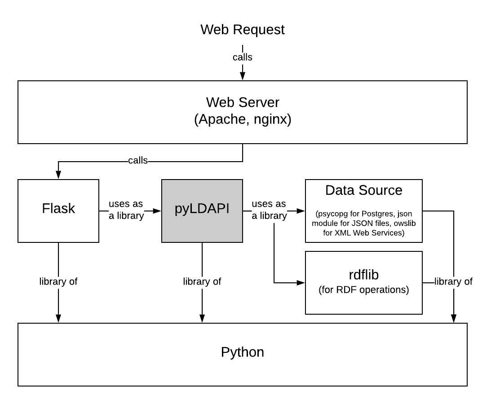
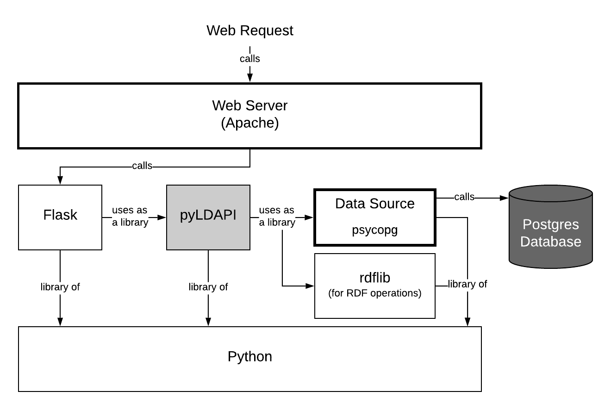
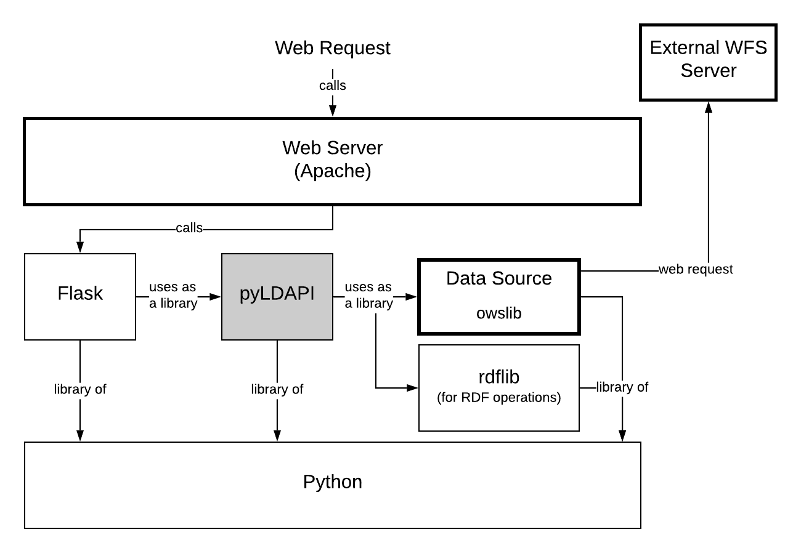

Welcome to pyLDAPI
==================

The Python Linked Data API (pyLDAPI) is:

*A very small module to add Linked Data API functionality to a Python Flask installation*.

|PyPI version|

.. |PyPI version| image:: https://badge.fury.io/py/pyldapi.svg
    :target: https://badge.fury.io/py/pyldapi

What is it?
-----------

This module contains a small Python module which is intended to be added (imported) into a `Python Flask <http://flask.pocoo.org/>`_ installation to add a small library of ``Renderer`` classes which can be used to handle requests and return responses in a manner consistent with `Linked Data <https://en.wikipedia.org/wiki/Linked_data>`__ principles of operation.

The intention is to make it easy to "Linked Data-enable" web APIs.

An API using this module will get:

* an *alt profile* for each endpoint that uses a ``Renderer`` class to return responses that the API delivers
   * this is a *profile*, or *view* of the resource that lists all other available profiles
* a *Register of Registers*
   * a start-up function that auto-generates a Register of Registers is run when the API is launched.
* a basic, over-writeable template for Registers' HTML & RDF
* all of the functionality defined by the W3C's `Content Negotiation by Profile <https://www.w3.org/TR/dx-prof-conneg/>`_ specification
   * to allow for requests of content that conform to data specifications and profiles

The main parts of pyLDAPI are as follows:

|blocks|

Web requests arrive at a Web Server, such as *Apache* or *nginx*, which then forwards (some of) them on to *Flask*, a Python web framework. Flask calls Python functions for web requests defined in a request/function mapping and may call pyLDAPI elements. Flask need not call pyLDAPI for all requests, just as Apache/nginx need not forward all web request to flask. pyLDAPI may then draw on any Python data source, such as database APIs, and uses the *rdflib* Python module to formulate RDF responses.

Definitions
-----------

Alt Profile
~~~~~~~~~~~
The *model view* that lists all other views. This API uses the definition of *alternates profile* presented at `https://promsns.org/def/alt <https://promsns.org/def/alt>`_.

Linked Data Principles
~~~~~~~~~~~~~~~~~~~~~~
The principles of making things available over the internet in both human and machine-readable forms. Codified by the World Wide Web Consortium. See `https://www.w3.org/standards/semanticweb/data <https://www.w3.org/standards/semanticweb/data>`_.

Model View
~~~~~~~~~~
A set of properties of a Linked Data object codified according to a standard or profile of a standard.

Object
~~~~~~
Any individual thing delivered according to *Linked Data* principles.

Register
~~~~~~~~
A simple listing of URIs of objects, delivered according to *Linked Data principles*.

Register of Registers
~~~~~~~~~~~~~~~~~~~~~
A *register* that lists all other registers which this API provides.

pyLDAPI in action
-----------------

* Register of Media Types
   * `https://w3id.org/mediatype/ <https://w3id.org/mediatype/>`_

* Linked Data version of the Geocoded National Address File
   * `http://linked.data.gov.au/dataset/gnaf <http://linked.data.gov.au/dataset/gnaf>`_

|gnaf|

Parts of the GNAF implementation

* Geoscience Australia's Sites, Samples Surveys Linked Data API
   * `http://pid.geoscience.gov.au/sample/ <http://pid.geoscience.gov.au/sample/>`_

* Linked Data version of the Australian Statistical Geography Standard product
   * `http://linked.data.gov.au/dataset/asgs <http://linked.data.gov.au/dataset/asgs>`_

|asgs|

Parts of the ASGS implementation

Documentation
-------------

Detailed documentation can be found at `https://pyldapi.readthedocs.io/ <https://pyldapi.readthedocs.io/>`_

Licence
-------

This is licensed under GNU General Public License (GPL) v3.0. See the `LICENSE deed <https://raw.githubusercontent.com/RDFLib/pyLDAPI/master/LICENSE>`_ for more details.

Contact
-------

Dr Nicholas Car (lead)
~~~~~~~~~~~~~~~~~~~~~~
| *Data Systems Architect*
| `SURROUND Australia Pty Ltd <https://surroundaustralia.com>`_
| `nicholas.car@surroundaustralia.com <nicholas.car@surroundaustralia.com>`_
| `https://orcid.org/0000-0002-8742-7730 <https://orcid.org/0000-0002-8742-7730>`_

Ashley Sommer (senior developer)
~~~~~~~~~~~~~~~~~~~~~~~~~~~~~~~~
| *Informatics Software Engineer*
| `CSIRO Land and Water <https://www.csiro.au/en/Research/LWF>`_
| `ashley.sommer@csiro.au <ashley.sommer@csiro.au>`_

Related work
------------

`pyLDAPI Client <http://pyldapi-client.readthedocs.io/>`_

* *A Simple helper library for consuming registers, indexes, and instances of classes exposed via a pyLDAPI endpoint.*

Changelog
---------
**3.0**

* Content Negotiation specification by Profile supported
* replaced all references to "format" with "Media Type" and "view" with "profile"
* renamed class View to Profile
* added unit tests for all profile functions
* added unit tests for main ConnegP functions