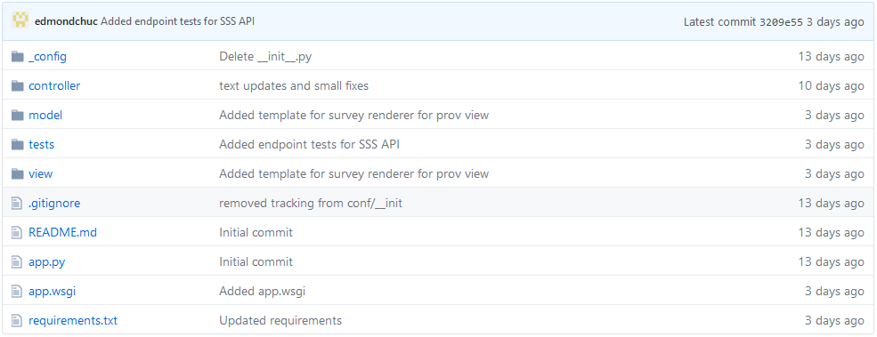

Installation
===============

.. attention:: See :ref:`requirements-reference` before getting started and make sure the requirements are met.

To install, use Python's PyPI by invoking :code:`pip install pyldapi` on the command line interface.

Now download the set of :ref:`demo-jinja-templates` and put them into a directory called :code:`view/templates` in your Flask project.

Recommended project structure
-----------------------------

We recommend a project structure as follows:

As shown in the image above, we recommend *this* model-view-controller architectural pattern for the project structure to maximise separation of concerns. The image above was taken from this_ repository.

.. _this: https://github.com/CSIRO-enviro-informatics/sss-api

The **controller** directory
~~~~~~~~~~~~~~~~~~~~~~~~~~~~

The **controller** directory is used to declare the Flask routes to your python functions.

The **model** directory
~~~~~~~~~~~~~~~~~~~~~~~

The **model** directory is used to declare the Python files that manage the data of the API.

The **view** directory
~~~~~~~~~~~~~~~~~~~~~~

The **view** directory contains the static content as well as the *required* Jinja2 templates for this API.