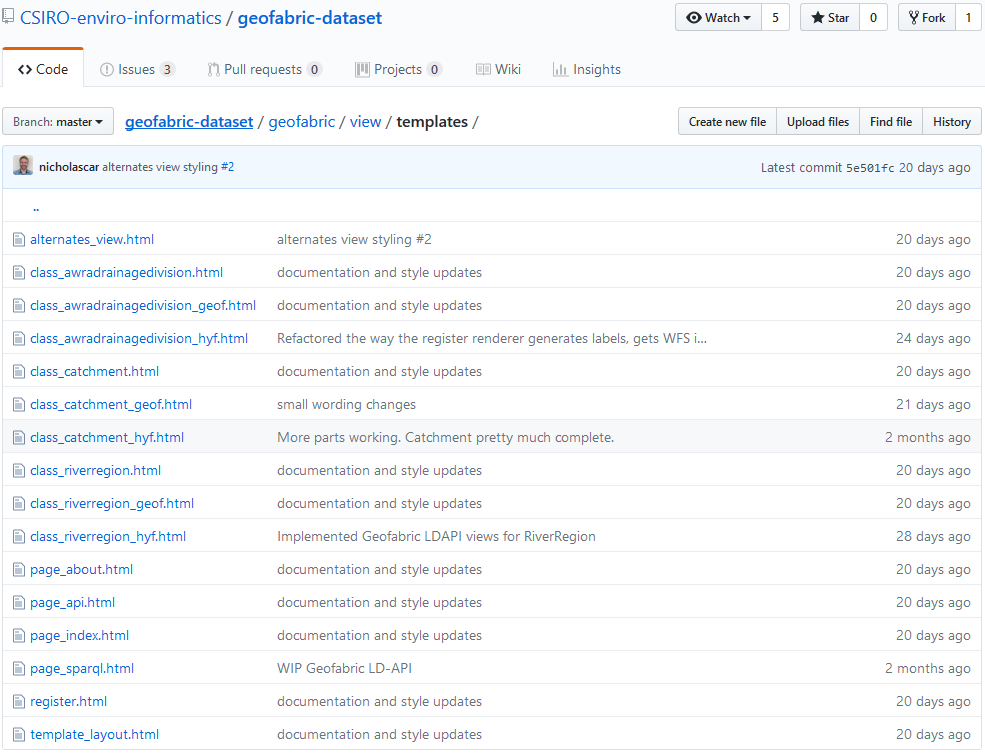

.. _requirements-reference:

Requirements
============

.. note:: To use the pyLDAPI module, a set of requirements must be met for the tool to work correctly.

Jinja2 Templates
----------------

Register
~~~~~~~~

A :code:`register.html` template is required to deliver a register of items.

Alternates
~~~~~~~~~~

An :code:`alternates.html` template is required to deliver an *alternates view* of a register or instance of a class. Alternatively, you can specify a different template for the alternates view by passing an optional argument to the :func:`pyldapi.Renderer.__init__` as :code:`alternates_template=`.

Class
~~~~~

A template for each class item in the dataset is required to render a class item.

Example: The online LD API for the Geofabric at `geofabricld.net`_ is exposing three class types, *Catchment*, *River Region* and *Drainage Division*. You can see in the image below showcasing the templates used for this API.

.. _geofabricld.net: http://geofabricld.net

.. note:: These are of course not the only Jinja2 templates that you will have. Other ones may include something like the API's home page, about page, etc. You can also see that there are more than one template for a specific class type in the image above. These different templates with *geof* and *hyf* are the different views for the specific class item. See :class:`.View` for more information.

.. seealso:: See also the template information under the **Jinja2 Templates** section of the documentation for more information in regards to what variables are required to pass in to the required templates.